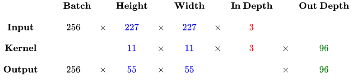

---

---

## 卷积层计算原理

+ **输入矩阵** 格式：有四个维度，依次是：样本数、图像高度，图像宽度和图像通道数
+ **输出矩阵**格式：与输出矩阵的维度顺序和含义相同，但是后三个维度（即图像高度、图像宽度和图像通道数）的尺寸发生改变
+ **权重矩阵**(卷积核)格式：同样也是四个维度，但是维度的含义和上面两者的含义不同，分别是：卷积核高度、卷积核宽度、输入通道数和输出通道数（等于卷积核的个数）

**输入矩阵、权重矩阵和输出矩阵三者之间的关系**

+ 卷积核的输入通道数由输入矩阵的通道数所决定；
+ 输出矩阵的通道数有卷积核的输出通道数所决定；
+ 输出矩阵的高度和宽度由输入矩阵、卷积核以及扫描方式所决定，计算如下：

$$
\left \{
\begin{aligned}
height_{out}=(height_{in}-height_{kernel}+2*padding)/stride+1\\
width_{out}=(width_{in}-width_{kernel}+2*padding)/stride+1
\end{aligned}
\right .
$$

卷基层的计算示例：

>以AlexNet模型的第一个卷积层为例：
>
>1. 输入图片的尺寸统一为227×227×3（高度×宽度×颜色通道数）
>2. 共有96个卷积核，每个卷积核的尺寸都是11×11×3
>3. 已知stride=4，padding=0
>4. 假设batch_size = 256
>5. 则输出矩阵的高度/宽度为(227-11+2*0)/4+1=55

 

